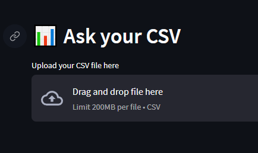
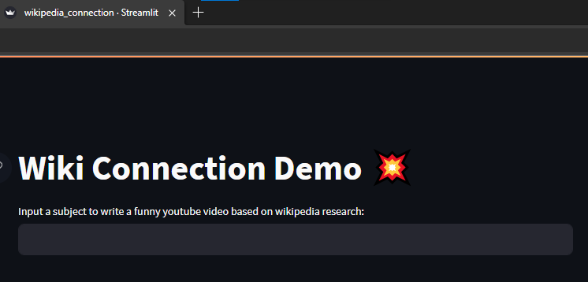

# LLM-Integration-Showcase

This repository contains three Python scripts that demonstrate the integration of LLMs for different use-cases, leveraging Langchain modules of LLMs, Agents, Chains, Prompt Templates, Memory, and Data Embeddings. These scripts showcase the application of AI in data interaction, content creation, and information retrieval.

## Showcase 1: Ask Your CSV

This Streamlit web app allows users to interact with their CSV data using an AI agent. Users can upload a CSV file, and then ask questions related to the data in the CSV.

Run: streamlit run csv_agent.py

## Showcase 2: Directory Embeddings

This script demonstrates how AI can be used to understand and respond based on the information available in a given directory of text files that is vectorized for the LLM to understand.

Run: python embed.py your_directory

## Showcase 3: Wikipedia Connection

This script generates creative content based on a user-provided topic which it uses to pull relevant content from Wikipedia. The script utilizes chains, memory and prompt templates.

streamlit run wikipedia_connection.py

## Contribution
Feel free to contribute to this development or use these scripts as a reference for your AI integration projects.
